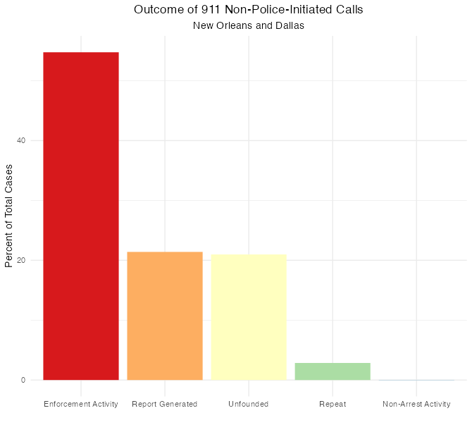
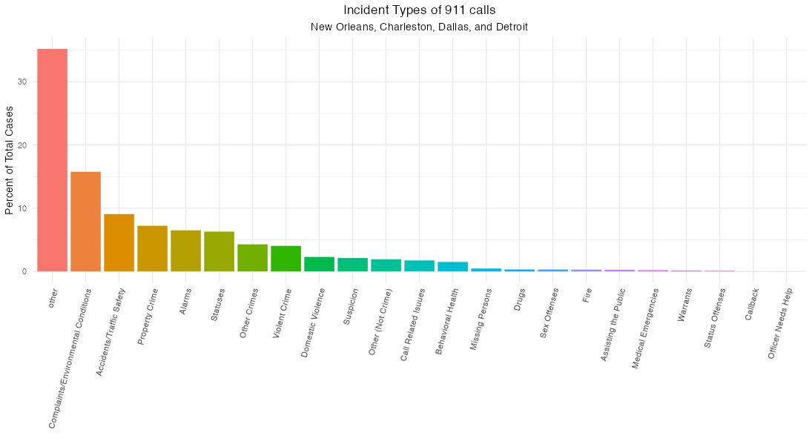
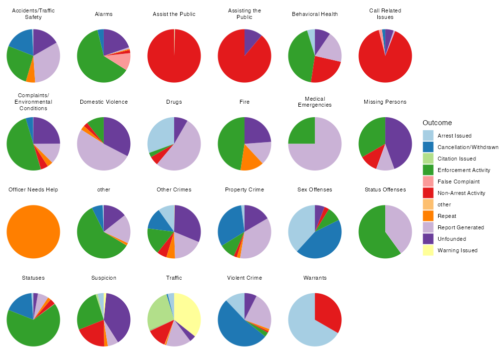

<p align="left">
בס"ד
<p/>


לפני שנתחיל לנתח נתונים ישראליים, באו נלמד כמה נתונים בסיסיים מהמערכת האמריקאית. הנתונים האלה ישמשו לנו כהשערות אפריוריות בניתוח הנתונים הישראליים. חשוב שתהיה לנו הבנה אפריורית מבוססת מכיוון שהנתונים הישראלים שנמצאים ברשותנו כרגע הם לא רק דלים מאוד אלא גם לעתים גם לא ברורים מצד משמעות המשתנים שבם. לעומת זאת, יש לנו [מערך נתונים נקי וברור](https://github.com/tsdataclinic/Vera/tree/master/data) עם מידע מארבעה ערים אמריקאיות (ניו אורלינס, דלס, דטרויט, וצ'רלסטון) על סיווג האירועים, ייזום השיחות (מהמשטרה או מהציבור), תוצאת האירוע, והרבה יותר. 
``` r
# Data manipulation
  library(tidyverse)
# Graphics that can deal with Hebrew text
  library(ragg)
  locale("he")

## For the sake of reasonable priors, let's look at some patterns in American 911 data

# American data from Charleston, Detroit, New Orleans, and Dallas 
# (sampled for faster computation - the dataset is 6,347,478 rows long):   
american <- read_csv("/Users/louisteitelbaum/Documents/all_calls.csv")[sample(1:6347478, 20000), -(1:26)]
```
כמה שאלות ראשוניות: 
- כמה אירועים נפתחו בעקבות קריאה למוקד מהציבור (לעומת זהויים עצמאיים של שוטרים)? 
- כמה שיחות הגיעו למוקד אך לא נפתח אירוע תגובה בעקבותם? בכמה מהם האירוע הסתיים בעקבות השיחה/לא היה צורך בתגובה/הטרדה וכו'? 
- כמה פניות למוקד התגלו כמקרי חירום? ממקרי החירום, כמה קיבלו מענה משטרטי?
- האם זה נפוץ שיש שינוי בין זיהוי הראשון של סוג האירוע ודיווח הסופי? יש סוגי אירוע שבהם הסיכוי של סיווג מוטעה גבוה יותר?

נתחיל בשאלת הייזום של השיחות. 
``` r
# What percentage of 911 calls are citizen-initiated?
american %>% 
  filter(city %in% c("Detroit", "NewOrleans")) %>%
  group_by(self_initiated) %>% 
  summarise(freq = n()/nrow(.))
      #> No (Citizen-initiated):  0.443
      #> Yes (Police-initiated):  0.328
      #> Other:                   0.228
```
44.3 אחוז של פניות הגיעו מהציבור בלי הצטרפות המשטרה. חשוב להזכיר שהנתונים האלה מגיעים משתי ערים גדולות (רק דטרויט וניו אורלינס מעניקים את המשתנה הזה). הייתי מנכש שהאחוז יהיה גבוה יותר במקומות פחות עירניים, איפה שיש פחות פעילות משטרתית באופן כללי. גם ראוי לציין שאני לא יודע מה המשמעות של "Other" בהקשר הזה. נראה לי שהכוונה למערכות אזעקות וכדומה, שיכולים ליזום אירוע משרתי בלי קשר גם לשוטרים וגם לאזרחים. רק לניו אורלינס יש את הקטגוריה הזאת. לדטרויט יש רק כן או לא ייזום פנימי. 

מה עם תוצאות השיחות?
```r
american %>%
  filter(is.na(disposition) == F, city != "Detroit") %>%
  group_by(disposition) %>%
  summarise(percent = 100*n()/nrow(.)) %>%
  arrange(desc(percent)) %>%
  ungroup() %>%
  mutate(disposition = factor(disposition, levels = disposition)) %>%
  ggplot(aes(disposition, percent, fill = disposition)) +
    geom_bar(stat = "identity") +
    guides(x = guide_axis(angle = 45)) +
    scale_fill_brewer(palette = "Spectral") +
    theme_minimal() +
    labs(title = "Outcome of 911 calls in New Orleans, Charleston, and Dallas", x = "", y = "Percent of Total Cases") +
    theme(plot.title = element_text(hjust = .5), legend.position = "none")
```
<p align="center">

</p>

אחלה תרשים! מה זה אומר? שאלה טובה - יש הרבה קטגוריות פה, ולא ברור מה הם בדיוק. נעבור אחד אחד ונתרגם קצת:
- פעילות אכיפה (Enforcement Activity)  39.9 %  : שליחת שוטרים לאתר בלא מעצר
- יצירת דו"ח (Report Generated)        16.8 %  : אני חושב שזה אומר שלא שלחו ניידת, אבל דיווחו על פשיעה או על פעילות חשודה
- לא מבוסס (Unfounded)       15.7 %
- פעילות ללא מעצר (Non-Arrest Activity)   10.8 %  : אני לא בטוח מה ההבדל בין זה לבין "Enforcement Activity" 
- מבוטל/נסוג (Cancellation/Withdrawn)  9.67 %
- חוזר (Repeat)     2.1 %  : כלומר, משהו כבר התקשר בנוגע לאורוע הזה? אותו ב"א כבר התקשר?
- מעצר (Arrest Issued)      1.9 % 
- נתינת אזהרה (Warning Issued)        1.3 % 
- נתינת דוח  (Citation Issued)          0.9 %  
- תלונת שוא (False Complaint)          0.7 % 
- אחר (other)                    0.2 %  

אוקיי, עדיין לא ברור לגמרי. למרבה המזל, מייצרי מערך הנתונים הסבירו את החשיבה שלהם [פה](https://medium.com/dataclinic/creating-a-consolidated-taxonomy-for-911-call-data-across-different-us-cities-part-2-9600cb09abfd). הם כותבים, "דלס השתשמה ב12 קטגוריות להתייחס לתוצאת השיחה. 80% סווגו כ"מבוטל"... עוד 18% הותאמו ל"מעצר". אנחנו מאמינים שזה מהווה מוגבלות של הנתונים ולא תכונה ייחודית של הקהילה בדלס, מכיוון שפניות שזוהו כגרמים לתגובה מינורית כולם סווגו כ"מבוטל. בסגנון דומה בצד שני של הספקטרום, 60% של הערכים מניו אורלינס סווגו כ"פעילות דרושה ננקטה," שהתאמנו ל"פעילות אכיפה". אבל באמת, קטגוריה זאת יכולה להתאים לכל תגובה חמורה או קלה."

...ועוד הרבה יותר. לפי דבריהם, הבעיה היא ש"בתוך עיר מסויימת, הקטגוריות בהן נעשה שימוש לסוג פנייה מסוים לעתים קרובות משתנות משנה לשנה, וגם הגדרות משתנות ככל שעובר הזמן... לא מפתיע, כי הנתונים האלה מגיעים ממערכת שמתוכננת לנווט שוטרים לאירועים ולספק תמיכה כאשר הם חוקרים פנייה. בתוך המערכת הזאת, ערכים אינם מתוכננות להקל על ניתוח הנתונים אלא להבטיח נגישות למידע בשביל השוטרים המגיבים לפנייה".  

הנה החלוקה לפי ערים:
<p align="center">

</p>

אז העבודה שלנו מסובכת יותר ממה שציפינו. אבל עדיין יש הרבה ללמוד. צריך לזכור שכרגע אנחנו מחפשים רק רקע ככלי כדי להבין את הנתונים הישראליים. אני אציג פה עוד כמה גרפים, ואז אשתדל לסכם את מה שיכלתי ללמוד מהם.

אם לוקחים רק את הפניות שבוודאי לא מגיעות מהמשטרה, התמונת התוצאות נהיה פשוטה יותר (אשמה של צ'רלסטון, שמסבכת את כל עבודת הסיווג אבל אינה מדווחת על ייזום השיחות). 
<p align="center">

</p>

רוב הפניות מסתיימות בשליחת שוטרים לאתר ללא מעצר. ביותר מ20% של מקרים, המוקדן מדווח על האירוע אבל אין פעילות משטרתית. בעוד 20%, הפנייה חסרה ביסוס בכלל.

ראינו את תוצאות הפניות למוקד. מה עם סוגי הפניות לכתחילה?
<p align="center">

</p>

הקבוצה ההכי גדולה (כ35%) היא דברים מגוונים שלא ידעו איך למיין אותם. אחרי זה, "תלונות/תנאים סביבתיים" תופס יותר מ15%. רכוש (גניבה, ונדליזם) ועבירות תנועה שניהם מתקרבים ל10%. פשיעה אלימה מהווה פחות מ5% אבל עדיין אינה זנוחה. בריאה נפשית מגיעה ל1 אחוז. שריפות ומקרי חירום רפואים הם זנוחים לגמרי.

עכשיו נחזור לתוצאות האירועים - אולי אפשר להבין יותר על הגדרות הקטגוריות על בסיס סוגי האירועים שמתגלגלים אליהם. 
```r
# Maybe we can learn more from the overlap between call type and outcome
american %>%
  mutate(call_type = str_wrap(call_type, width = 18)) %>%
  filter(is.na(disposition) == F, 
         is.na(call_type) == F,
         disposition != "Unknown", 
         self_initiated %in% c("No", "other")) %>%
  ggplot(aes(x = "", fill = disposition)) +
    facet_wrap(~call_type, nrow = 4) +
    geom_bar(position = "fill") +
    scale_fill_brewer(name = "Outcome", palette = "Paired") +
    coord_polar("y") +
    theme_void()
```
<p align="center">

</p>
