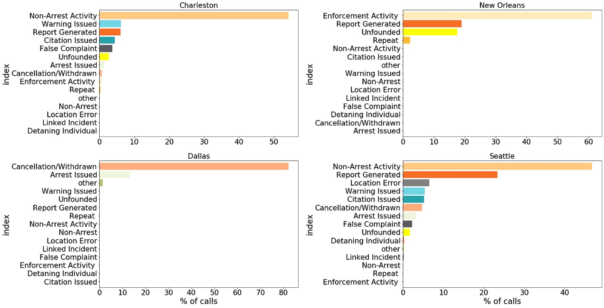
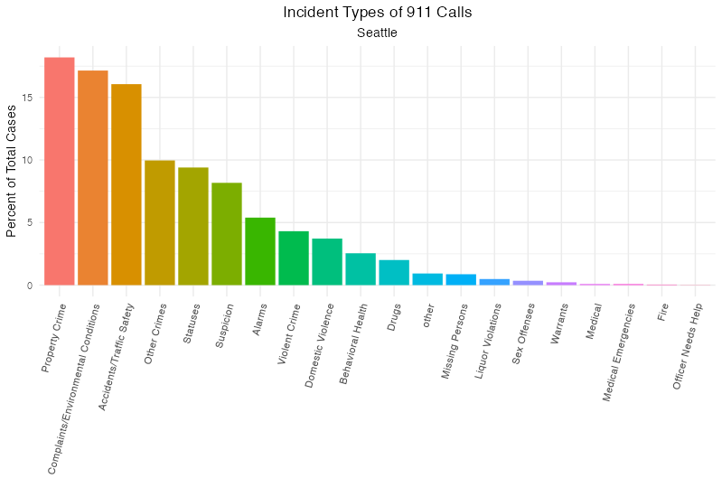
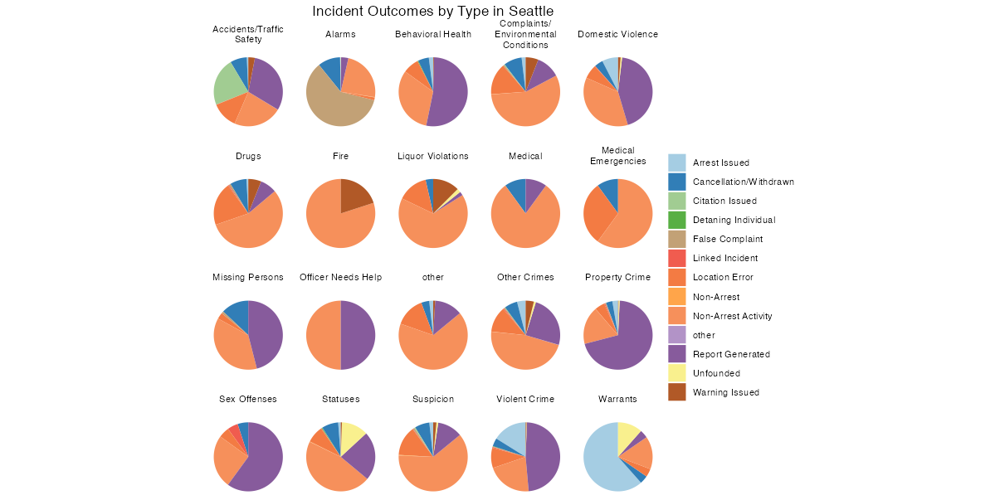
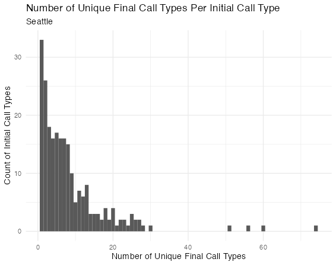
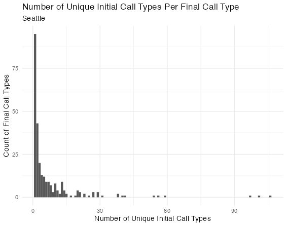
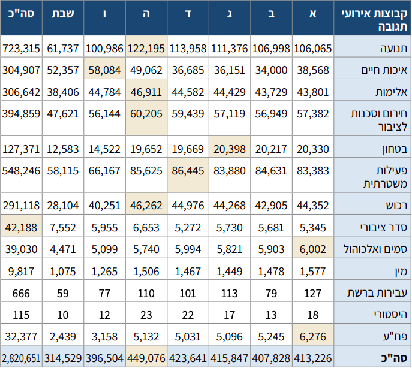
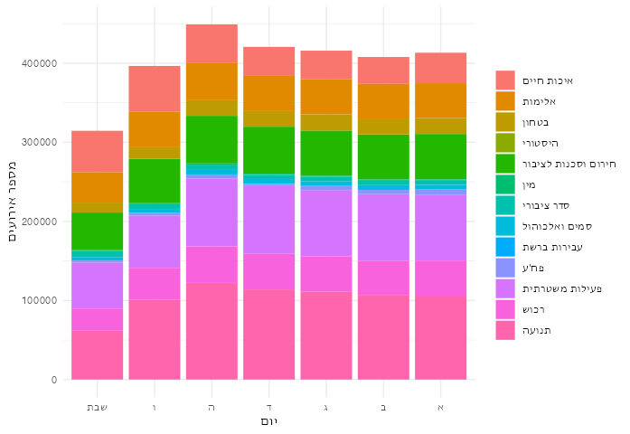
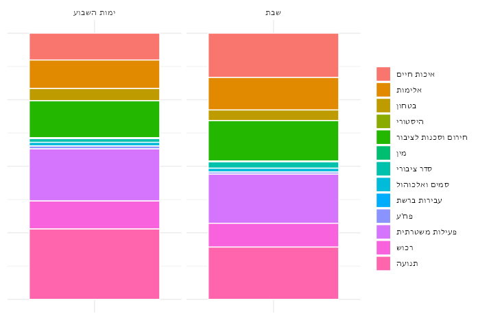
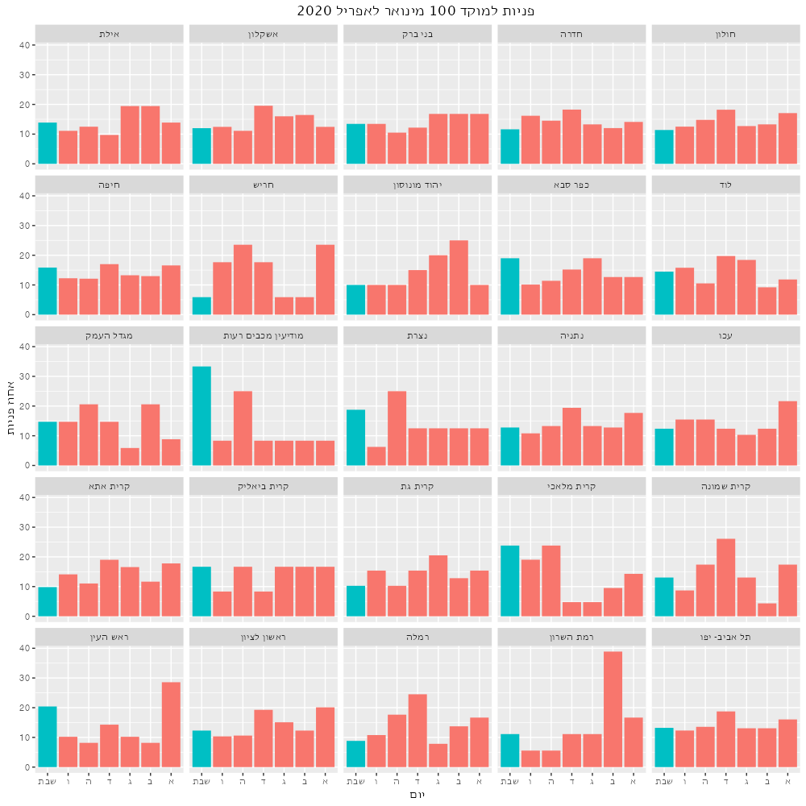

<p align="left">
בס"ד
<p/>


לפני שנתחיל לנתח נתונים ישראליים, באו נלמד כמה נתונים בסיסיים מהמערכת האמריקאית. הנתונים האלה ישמשו לנו כהשערות אפריוריות בניתוח הנתונים הישראליים. חשוב שתהיה לנו הבנה אפריורית מבוססת מכיוון שהנתונים הישראלים שנמצאים ברשותנו כרגע הם לא רק דלים מאוד אלא גם לעתים גם לא ברורים מצד משמעות המשתנים שבם. לעומת זאת, יש לנו [מערך נתונים נקי וברור](https://github.com/tsdataclinic/Vera/tree/master/data) עם מידע מארבעה ערים אמריקאיות (ניו אורלינס, דלס, דטרויט, וצ'רלסטון) על סיווג האירועים, ייזום השיחות (מהמשטרה או מהציבור), תוצאת האירוע, והרבה יותר. 
``` r
# Data manipulation
  library(tidyverse)
# Graphics that can deal with Hebrew text
  library(ragg)
  locale("he")

## For the sake of reasonable priors, let's look at some patterns in American 911 data

# American data from Charleston, Detroit, New Orleans, and Dallas 
# (sampled for faster computation - the dataset is 6,347,478 rows long):   
american <- read_csv("/Users/louisteitelbaum/Documents/all_calls.csv")[sample(1:6347478, 20000), -(1:26)]
```
כמה שאלות ראשוניות: 
- כמה אירועים נפתחו בעקבות קריאה למוקד מהציבור (לעומת זהויים עצמאיים של שוטרים)? 
- כמה שיחות הגיעו למוקד אך לא נפתח אירוע תגובה בעקבותם? בכמה מהם האירוע הסתיים בעקבות השיחה/לא היה צורך בתגובה/הטרדה וכו'? 
- כמה פניות למוקד התגלו כמקרי חירום? ממקרי החירום, כמה קיבלו מענה משטרטי?
- האם זה נפוץ שיש שינוי בין זיהוי הראשון של סוג האירוע ודיווח הסופי? יש סוגי אירוע שבהם הסיכוי של סיווג מוטעה גבוה יותר?

***הגעת לחלק החופר, כאשר עדיין לא התמקמתי בנתונים. אם אתה לא רוצה ללכת איתי בהרפתקאה הזאת, אתה מוזמן לדלג עד הכותרת "סיכום הנתונים האמריקאים".***

נתחיל בשאלת הייזום של השיחות. 
``` r
# What percentage of 911 calls are citizen-initiated?
american %>% 
  filter(city %in% c("Detroit", "NewOrleans")) %>%
  group_by(self_initiated) %>% 
  summarise(freq = n()/nrow(.))
      #> No (Citizen-initiated):  0.443
      #> Yes (Police-initiated):  0.328
      #> Other:                   0.228
```
44.3 אחוז של פניות הגיעו מהציבור בלי הצטרפות המשטרה. חשוב להזכיר שהנתונים האלה מגיעים משתי ערים גדולות (רק דטרויט וניו אורלינס מעניקים את המשתנה הזה). הייתי מנכש שהאחוז יהיה גבוה יותר במקומות פחות עירניים, איפה שיש פחות פעילות משטרתית באופן כללי. גם ראוי לציין שאני לא יודע מה המשמעות של "Other" בהקשר הזה. נראה לי שהכוונה למערכות אזעקות וכדומה, שיכולים ליזום אירוע משרתי בלי קשר גם לשוטרים וגם לאזרחים. רק לניו אורלינס יש את הקטגוריה הזאת. לדטרויט יש רק כן או לא ייזום פנימי. 

מה עם תוצאות השיחות?
```r
american %>%
  filter(is.na(disposition) == F, city != "Detroit") %>%
  group_by(disposition) %>%
  summarise(percent = 100*n()/nrow(.)) %>%
  arrange(desc(percent)) %>%
  ungroup() %>%
  mutate(disposition = factor(disposition, levels = disposition)) %>%
  ggplot(aes(disposition, percent, fill = disposition)) +
    geom_bar(stat = "identity") +
    guides(x = guide_axis(angle = 45)) +
    scale_fill_brewer(palette = "Spectral") +
    theme_minimal() +
    labs(title = "Outcome of 911 calls in New Orleans, Charleston, and Dallas", x = "", y = "Percent of Total Cases") +
    theme(plot.title = element_text(hjust = .5), legend.position = "none")
```
<p align="center">

</p>

אחלה תרשים! מה זה אומר? שאלה טובה - יש הרבה קטגוריות פה, ולא ברור מה הם בדיוק. נעבור אחד אחד ונתרגם קצת:
- פעילות אכיפה (Enforcement Activity)  39.9 %  : שליחת שוטרים לאתר בלא מעצר
- יצירת דו"ח (Report Generated)        16.8 %  : אני חושב שזה אומר שלא שלחו ניידת, אבל דיווחו על פשיעה או על פעילות חשודה
- לא מבוסס (Unfounded)       15.7 %
- פעילות ללא מעצר (Non-Arrest Activity)   10.8 %  : אני לא בטוח מה ההבדל בין זה לבין "Enforcement Activity" 
- מבוטל/נסוג (Cancellation/Withdrawn)  9.67 %
- חוזר (Repeat)     2.1 %  : כלומר, משהו כבר התקשר בנוגע לאורוע הזה? אותו ב"א כבר התקשר?
- מעצר (Arrest Issued)      1.9 % 
- נתינת אזהרה (Warning Issued)        1.3 % 
- נתינת דוח  (Citation Issued)          0.9 %  
- תלונת שוא (False Complaint)          0.7 % 
- אחר (other)                    0.2 %  

אוקיי, עדיין לא ברור לגמרי. למרבה המזל, מייצרי מערך הנתונים הסבירו את החשיבה שלהם [פה](https://medium.com/dataclinic/creating-a-consolidated-taxonomy-for-911-call-data-across-different-us-cities-part-2-9600cb09abfd). הם כותבים, "דלס השתשמה ב12 קטגוריות להתייחס לתוצאת השיחה. 80% סווגו כ"מבוטל"... עוד 18% הותאמו ל"מעצר". אנחנו מאמינים שזה מהווה מוגבלות של הנתונים ולא תכונה ייחודית של הקהילה בדלס, מכיוון שפניות שזוהו כגרמים לתגובה מינורית כולם סווגו כ"מבוטל. בסגנון דומה בצד שני של הספקטרום, 60% של הערכים מניו אורלינס סווגו כ"פעילות דרושה ננקטה," שהתאמנו ל"פעילות אכיפה". אבל באמת, קטגוריה זאת יכולה להתאים לכל תגובה חמורה או קלה."

...ועוד הרבה יותר. לפי דבריהם, הבעיה היא ש"בתוך עיר מסויימת, הקטגוריות בהן נעשה שימוש לסוג פנייה מסוים לעתים קרובות משתנות משנה לשנה, וגם הגדרות משתנות ככל שעובר הזמן... לא מפתיע, כי הנתונים האלה מגיעים ממערכת שמתוכננת לנווט שוטרים לאירועים ולספק תמיכה כאשר הם חוקרים פנייה. בתוך המערכת הזאת, ערכים אינם מתוכננות להקל על ניתוח הנתונים אלא להבטיח נגישות למידע בשביל השוטרים המגיבים לפנייה".  

הנה החלוקה לפי ערים:
<p align="center">

</p>

אז העבודה שלנו מסובכת יותר ממה שציפינו. אבל עדיין יש הרבה ללמוד. צריך לזכור שכרגע אנחנו מחפשים רק רקע ככלי כדי להבין את הנתונים הישראליים. אני אציג פה עוד כמה גרפים, ואז אשתדל לסכם את מה שיכלתי ללמוד מהם.

אם לוקחים רק את הפניות שבוודאי לא מגיעות מהמשטרה, התמונת התוצאות נהיה פשוטה יותר (אשמה של צ'רלסטון, שמסבכת את כל עבודת הסיווג אבל אינה מדווחת על ייזום השיחות). 
<p align="center">

</p>

רוב הפניות מסתיימות בשליחת שוטרים לאתר ללא מעצר. ביותר מ20% של מקרים, המוקדן מדווח על האירוע אבל אין פעילות משטרתית. בעוד 20%, הפנייה חסרה ביסוס בכלל.

ראינו את תוצאות הפניות למוקד. מה עם סוגי הפניות לכתחילה?
<p align="center">

</p>

הנה סיאטל, להשוואה: 
<p align="center">

</p>

הקבוצה ההכי גדולה (כ35%) היא דברים מגוונים שלא ידעו איך למיין אותם. אחרי זה, "תלונות/תנאים סביבתיים" תופס יותר מ15%. רכוש (גניבה, ונדליזם) ועבירות תנועה שניהם מתקרבים ל10%. פשע אלים מהווה פחות מ5% אבל עדיין אינה זנוחה. בריאות הנפש מגיעה ל1 אחוז. שריפות ומקרי חירום רפואים הם זנוחים לגמרי. סדר הנתונים בסיאטל הוא דומה, רק בלי ההסתפקות בחלק הגדול ביותר.

עכשיו נחזור לתוצאות האירועים - אולי אפשר להבין יותר על הגדרות הקטגוריות על בסיס סוגי האירועים שמתגלגלים אליהם. התרשים הבא מייצג רק את ניו אורלינס - דלס, דטרויט, וצ'רלסטון כולם חסרות או ייזום השיחות או תוצאות.
```r
# Maybe we can learn more from the overlap between call type and outcome
american %>%
  mutate(call_type = str_wrap(call_type, width = 18)) %>%
  filter(is.na(disposition) == F, 
         is.na(call_type) == F,
         disposition != "Unknown", 
         self_initiated %in% c("No", "other")) %>%
  ggplot(aes(x = "", fill = disposition)) +
    facet_wrap(~call_type, nrow = 4) +
    geom_bar(position = "fill") +
    scale_fill_brewer(name = "Outcome", palette = "Paired") +
    coord_polar("y") +
    theme_void()
```
<p align="center">

</p>

פניות הקשורות לעבירות רכוש, עבירות תנועה, אלימות במשפחה, ופשע אלים מסתיימים הרבה פעמים בפעילות אכיפה, אבל יותר נפוץ שהם מתגלים כחסרי ביסוס, והרבה יותר נפוץ שהם מסתיימים (מבחינת המשטרה) ביצירת דו"ח. אני מניח שבהקשר הזה "יצירת דו"ח" אומר שהאירוע הסתיים כך שהמצב כבר לא היה דחוף, ולכן דיווחו על האירוע לצורך טיפול עתידי. מקרי חירום רפואי נראים דומים, רק בלי הסיכוי שהם לא מבוססים. כאן אבל, הייתי רוצה להאמין שב"יצירת דו"ח" הכוונה להתרעה בפני הגופים הרלוונטיים - אמבולנס וכו'. כנ"ל לגבי יצירת דו"חות בשריפות, אלא ששוטרים נוטים כן להגיע לשריפות. נעדרים, עבירות מין, חשד, ואזעקות כולם מחולקים בין פעילות אכיפה לחסר ביסוס. קריאות הקשורות לבריאות הנפש נוטים להענות עם "פעילות אכיפה", אבל לפעמים רק ביצירת דו"ח.

לוודא שמה שאנחנו רואים ניתן להכללה, נעיין רגע בנתונים המקבילים מסיאטל, שלא היה מוצג לעיל, ושהקטגוריות שלה הן קצת יותר מפורטות:
```r
seattle <- read_csv("/Users/louisteitelbaum/Downloads/Seattle.csv.zip")[sample(1:4206691, 20000),]
seattle %>%
  mutate(call_type = str_wrap(call_type, width = 18)) %>%
  filter(is.na(disposition) == F, 
         is.na(call_type) == F,
         disposition != "Unknown", 
         self_initiated %in% c("No", "other")) %>%
  ggplot(aes(x = "", fill = disposition)) +
  facet_wrap(~call_type, nrow = 4) +
  geom_bar(position = "fill") +
  coord_polar("y") +
  theme_void() +
  labs(title = "Incident Outcomes by Type in Seattle") +
  theme(plot.title = element_text(hjust = .5) , legend.title = element_blank())
```

<p align="center">

</p>

לעיניי, התמונה פה דומה למה שראינו בניו אורלינס. חידוש אחד שאפשר לזהות: במקום החלק הגדול של "לא מבוסס" שראינו מקודם (21.2% בניו אורלינס), פה יש מבוטל (6.6% סה"כ), תלונת שוא (3.6%), לא מבוסס (1.5%), והכי מפתיע - שגיאת מיקום (10.1%). ע"פ זה נראה שאחוז משמעותי של אירועים - ובמיוחד מקרי חירום רפואי - מסתיימים במצב בו המשטרה לא מצליח למקם את האירוע. אני לא יודע מה לעשות עם זה.

שאלה אחרונה: רציתי לדעת אם זה נפוץ שזיהוי הראשוני של סוג האירוע מתגלה כשגוי. לענות על זה, נצטרך למצוא את הנתונים הגולמיים מסיאטל, שמדווחת על שני הזיהויים. 
```r
seattle_raw <- read_csv("/Users/louisteitelbaum/Downloads/Call_Data_Seattle.csv")[sample(1:4842110, 20000),]
```
די מהר אחרי שפתחתי את המערך הזה, ראיתי את הבעיה:
```r
seattle_raw %>%
  group_by(`Initial Call Type`, `Final Call Type`) %>%
  summarise() %>% 
  group_by(`Initial Call Type`) %>%
  summarise(ntypes = n()) %>%
  ggplot(aes(ntypes)) +
    geom_histogram(binwidth = 1) + 
    labs(title = "Number of Unique Final Call Types Per Initial Call Type", 
         subtitle = "Seattle",
         x = "Number of Unique Final Call Types",
         y = "Count of Initial Call Types") +
    theme_minimal()

seattle_raw %>%
  group_by(`Initial Call Type`, `Final Call Type`) %>%
  summarise() %>% 
  group_by(`Final Call Type`) %>%
  summarise(ntypes = n()) %>%
  ggplot(aes(ntypes)) +
  geom_histogram(binwidth = 1) + 
  labs(title = "Number of Unique Initial Call Types Per Final Call Type", 
       subtitle = "Seattle",
       x = "Number of Unique Initial Call Types",
       y = "Count of Final Call Types") +
  theme_minimal()
```
<p align="right">


</p>

במילים אחרות, פרדיגמות הסיווג בזיהוי ראשוני וזיהוי סופי הם שונים לגמרי. יש הרבה סוגים ראשוניים שמתחלקים לעשר ואפילו עשרים סוגים סופיים, ויש הרבה סוגים סופיים שכוללים אפילו שלושים סוגים ראשוניים. ניתן עוד לעקוב אחרי השאלה הזאת (למשל, עם cosine similarity למדוד את הדמיון הלשוני בין ראשוני לסופי), אבל אין לי את הזמן או את הרצון כרגע.  

אני מתחיל להרגיש יותר בבית בנתונים האלה. אפשר לסכם את מה למדנו.

# סיכום הנתונים האמריקאים
- אחוז משמעותי של אירועים במוקד מגיעים מזיהויים עצמאיים של שוטרים, אבל לא רוב המוחלט (ניו אורלינס - 20%, סיאטל - 41%, דטרויט - 55%)
- קרוב לחצי מהשיחות שמגיעות למוקד לא מובילות לפעילות משטרתית אקטיבית (סיאטל - 52%, ניו אורלינס - 45%). עם זאת, רוב מוחלט מהמקרים האלה נסגרים או בדיווח משטרתי (לפעמים לאמבולנס או לכבאות) או באי-יכולת לאתר את האירוע. אולי 5% מתגלים כתלונת שוא כלשהי. כ7% בוטלות תוך כדי השיחה.
- קשה לדעת כמה פניות אפשר להחשב כמקרי חירום, כאשר הרבה מהאירועים מסוג הזה כבר הסתיימו בזמן השיחה ולכן לא קיבלו מענה משטרתי. אפשר להגיד, אבל, שאירועים הקשורים לבריאות הנפש מייצגים כ3% של שיחות (רובם ב"א אבדני, חולה נפש מסתובב ברחוב באופן לא מסוכן, או מנת יתר). חירום רפואי מייצג פחוז מ1%.
- קשה לדעת כמה זהויים שגויים יש, אבל כן אפשר להגיד ש*יש* זיהוי ראשוני ע"י המוקדן, וזיהוי סופי אחרי סיום האירוע.
- בכללי, כל הנתונים מהמוקד קיימים בראש ובראשונה לעזור לפעילות המוקד. כתוצאה מזאת, אין שום סטנדרטיזציה, וקשה לקבל שום תמונה רחבה שהיא על העניינים.

# הנתונים הישראליים
נתונים על מוקד 100 מ[פה](https://www.gov.il/BlobFolder/reports/police_statistical_abstract_2020/he/%D7%94%D7%A9%D7%A0%D7%AA%D7%95%D7%9F%20%D7%94%D7%A1%D7%98%D7%98%D7%99%D7%A1%D7%98%D7%99%20%D7%A9%D7%9C%20%D7%9E%D7%A9%D7%98%D7%A8%D7%AA%20%D7%99%D7%A9%D7%A8%D7%90%D7%9C%20%D7%9C%D7%A9%D7%A0%D7%AA%202020.pdf), [פה](https://www.odata.org.il/dataset/f4a3cbdb-4c9f-4445-ac8e-221101f825c8), [ופה](https://www.odata.org.il/dataset/e-haim). על אוכלוסייה מ[פה](https://www.cbs.gov.il/he/settlements/Pages/default.aspx?mode=Yeshuv).
```r
# Incoming calls by region, city, day of week (Jan 1 - March 21, 2020)
day.place.1 <- read_csv("/Users/louisteitelbaum/Documents/moked_janfebmar.csv",
                        locale = locale(date_names = "he", encoding = "UTF-8"))

# Incoming calls by region, city, day of week (March 21 - April 30, 2020)
day.place.2 <- read_csv("/Users/louisteitelbaum/Documents/moked_marapr.csv",
                        locale = locale(date_names = "he", encoding = "UTF-8"))

# General Population Demographics
demographics <- read_csv("/Users/louisteitelbaum/Documents/demographics/demographics.csv")
demographics <- demographics[-(1:11), c(2, 8, 11)]
names(demographics) <- c("ir", "pop", "arabs")
demographics$pop[demographics$pop == "-"] <- 0
demographics$arabs[demographics$arabs == "-"] <- 0
demographics$pop <- as.numeric(gsub(",", "", demographics$pop))
demographics$arabs <- as.numeric(gsub(",", "", demographics$arabs))

# Incidents (unclear what this means exactly) by city, type, subtype, year, and quarter (2015-2017)
type.place.year <- read_csv("/Users/louisteitelbaum/Documents/moked100.csv")
type.place.year <- type.place.year[-(1:6), c(1:3, 5:6, 11, 16)]
names(type.place.year) <- c("ir", "type", "subtype", "total", "2015", "2016", "2017Q1-2")
type.place.year <- type.place.year %>%
  mutate(across(4:7, ~replace(., . == "$", "1"))) %>%
  mutate(across(4:7, ~replace(., . == "-", "0"))) %>%
  type_convert()
```
אם רוצים לדעת על סכנת מוות, ובמיוחד במישור ההלכתי, יש לנו הזדמנות בישראל שלא היתה לנו בארה"ב: התנהגות הדתיים. אם בדרך כלל יש אחוז משעותי של פניות למוקד שהם *אינם* מהווים סכנת מוות (ולכן אסורים בשבת על פי הלכה כפי שהיא נהוגה), נוכל לצפות שמספר הפנות ירד באופן משמעותי בשבת, ובמיוחד במקומות אם אוכלוסייה דתית יותר. 

לצערנו, השנתון הסטטיסטי של משטרת ישראל לא מדווח על חלוקה של פניות לימות השבוע. הוא כן מחלק ככה את אירועי התגובה ("מענה לאירוע עקב קריאה שנתקבלה מהציבור או זיהוי עצמי של
שוטר אשר פתח אירוע במוקד"). הנה הנתונים משנת 2020:
<p align="center">

</p>

קשה לי לראות מה קורה בטבלה כזאת. הנה אותו דבר בתרשים:
```r

weekdays <- tibble(type = c("תנועה", "איכות חיים", "אלימות", "חירום וסכנות לציבור", "בטחון", "פעילות משטרתית", "רכוש", "סדר ציבורי", "סמים ואלכוהול", "מין", "עבירות ברשת",   "היסטורי", "פח'ע"),
                   א = c(106065, 38568, 43801, 57382, 20330, 83383, 44352, 5345, 6002, 1577, 127, 18, 6276),
                   ב = c(106998, 34000, 43729, 56949, 20217, 84631, 42905, 5681, 5903, 1478, 79, 13, 5245),
                   ג = c(111376, 36151, 44429, 57119, 20393, 83880, 44268, 5730, 5821, 1449, 113, 17, 5096),
                   ד = c(113958, 36685, 44582, 59439, 19669, 86445, 44976, 5272, 5994, 1467, 101, 22, 2031),
                   ה = c(122195, 49062, 46911, 60205, 19652, 85625, 46262, 6653, 5740, 1506, 110, 23, 5132),
                   ו = c(100986, 58084, 44784, 56144, 14522, 66167, 40251, 5955, 5099, 1265, 77, 12, 3158),
                   שבת = c(61737, 52357, 38406, 47621, 12583, 58115, 28104, 7552, 4471, 1075, 59, 10, 2439))
weekdays <- weekdays %>%
  pivot_longer(2:8, names_to = "day", values_to = "n") %>%
  mutate(day = factor(day, levels = c("שבת", "ו", "ה", "ד", "ג", "ב", "א")))
options(scipen=10000)

ggplot(weekdays, aes(day, n, fill = type)) +
  geom_bar(stat = "identity") +
  theme_minimal() +
  theme(legend.title = element_blank()) +
  labs(x = "יום",
       y = "מספר אירועים")
```
<p align="center">

</p>

לא צריך כלים סטטיסטים לראות שמספר האירועים נמוך יותר בשבת. עדיין קצת קשה לראות את הפרופורציות. הנה השוואה בין פרופוציות הממוצעות של ימי השבוע לבין הפרופורציות של שבת:
```r
weekdays %>%
  mutate(shabbat = recode(if_else(day == "שבת", "Y", "N"), "Y" = "שבת", "N" = "ימות השבוע")) %>%
  group_by(shabbat, type) %>%
  summarise(n = sum(n)) %>%
  group_by(shabbat) %>%
  summarise(type = type, prop = n/sum(n)) %>%
  ggplot(aes(x = "", prop, fill = type)) +
    geom_bar(stat = "identity", color = "white") +
    facet_wrap(~shabbat) +
    theme_minimal() +
    theme(axis.text.y = element_blank(), axis.title = element_blank(), legend.title = element_blank())
```
<p align="center">

</p>

בשבת יש פרופורציה קטנה יחסית של אירועי תנועה. זה הגיוני. יש גם פרופורציה *גדולה* יחסית של אירועי איכות חיים. אפשר לנחש שזה מייצג את הבלגן והרעש של סופ"ש, מצורף עם כמות נמוכה של כל הסוגים האחרים. 
אף אחד מאלה לא מוכיחים שמספר האירועים הכללי בשבת הוא תוצאה של התנהגות הדתיים במדינה. סביר להניח שגם חילינום נוסעים פחות בשבת - אין עבודה - ולכן יש פחות אירועים במשטרה. גם יכול להיות שהמשטרה היא קצת יותר עצלנית בסופ"שים ולכן מטפלת בקצת פחות אירועים בכל הקטגוריות (תזכר שאנחנו מסתכלים רק על אירועי תגובה כרגע).

למרבה המזל, יש לנו נתונים על *פניות* למוקד מחולקים גם לימי השבוע וגם לערים. האם אפשר לראות שלערים עם אוכלוסייה דתית יותר יש הפרש גדול יותר בין הפניות בשבת לבין ימי החול? נסתכל על כמה ערים.
```r
#~~~~~~~~~~~~~~~~~~~~~~~~~~~~~~~~~~~~~~~~~~~~~~~~~~~~~~~~~~~~~~~~~~~~~~~~~~~~~~~~~~~~~~~~~~~~~~~~~~~~~~~~~~~~~~~
# WRANGLE DATA (Incoming calls by region, city, day of week)
#~~~~~~~~~~~~~~~~~~~~~~~~~~~~~~~~~~~~~~~~~~~~~~~~~~~~~~~~~~~~~~~~~~~~~~~~~~~~~~~~~~~~~~~~~~~~~~~~~~~~~~~~~~~~~~~

# Variable names into English
names(day.place.1) <- c("mahoz", "hodesh", "ir", "yom", "n") -> names(day.place.2)

# Only cities for which we have info on all weekdays for each month
day.place.1 <- day.place.1 %>%
  group_by(mahoz, hodesh, ir) %>%
  filter(n() == 7) %>%
  ungroup()

day.place.2 <- day.place.2 %>%
  group_by(mahoz, hodesh, ir) %>%
  filter(n() == 7) %>%
  ungroup()

# Combine day.place.1 and day.place.2
day.place <- bind_rows(day.place.1, day.place.2)
rm(list = c("day.place.1", "day.place.2"))

# Remove summing rows
day.place <- day.place[day.place$mahoz != 'סה"כ' & day.place$mahoz != "Total", ]
day.place <- day.place[day.place$hodesh != "Total" & day.place$ir != "Total" & day.place$yom != "Total", ]

# Rename + Factorize days of the week
day.place <- day.place %>%
  mutate(yom = factor(yom, 
                       levels = c(unique(day.place$yom)[1], 
                                  unique(day.place$yom)[6], 
                                  unique(day.place$yom)[7], 
                                  unique(day.place$yom)[2],
                                  unique(day.place$yom)[5], 
                                  unique(day.place$yom)[4],
                                  unique(day.place$yom)[3]), 
                       labels = c("שבת", "ו", "ה", "ד", "ג", "ב", "א")))

# One case per weekday per city
day.place <- day.place %>%
  group_by(mahoz, ir, yom) %>%
  summarise(n = sum(n)) %>%
  ungroup()

day.place <- day.place[day.place$ir != "לא ידוע", ]

# Add variables to see proportion of calls coming in on each day
day.place <- day.place %>%
  left_join(demographics) %>%
  group_by(ir) %>%
  mutate(daypercent = 100*n/sum(n),
         callspercap = n/pop) %>%
  ungroup()
  
#~~~~~~~~~~~~~~~~~~~~~~~~~~~~~~~~~~~~~~~~~~~~~~~~~~~~~~~~~~~~~~~~~~~~~~~~~~~~~~~~~~~~~~~~~~~~~~~~~~~~~~~~~~~~~~~
# VISUALIZE 
#~~~~~~~~~~~~~~~~~~~~~~~~~~~~~~~~~~~~~~~~~~~~~~~~~~~~~~~~~~~~~~~~~~~~~~~~~~~~~~~~~~~~~~~~~~~~~~~~~~~~~~~~~~~~~~~

day.place[day.place$ir %in% unique(day.place$ir)[sample(1:56, 25)], ] %>%
  ggplot(aes(yom, daypercent, fill = (yom == "שבת") )) +
  geom_bar(stat = "identity") +
  facet_wrap(~ir) +
  theme(legend.position = "none", 
        plot.title = element_text(hjust = 0.5)) +
  labs(x = "יום",
       y = "אחוז פניות",
       title = "2020 מינואר לאפריל 100 פניות למוקד ")
```

<p align="center">

</p>

אני לא רואה שום נטייה פה. אולי אני פשות לא מכיר כמה דתיים יש בכל עיר. אם נדע את גודל האוכלוסייה הדתית בכל עיר (בייחס לאוכלוססיה הככלית כמובן) נוכל לבנות מודל סטטיסטי ולראות אם אוכלוסייה דתית יותר גורמת להנמחת הפניות למוקד בשבת.
בליתי הרבה זמן בחיפוש הנתונים האלה. [מפקד האוכלוסין](https://www.cbs.gov.il/he/settlements/Pages/default.aspx?mode=Yeshuv) סופר כמה יהודים יש בכל עיר, אבל לא כמה דתיים. [מרכז המחקר פיו](https://www.pewforum.org/2016/03/08/israels-religiously-divided-society/) מונה את הדתיים למיניהם אבל מחלק רק למחוזות, לא ערים. נצטרך למצוא [proxy](https://en.wikipedia.org/wiki/Proxy_(statistics)) - משתנה שמתואם מספיק ליעד. 
