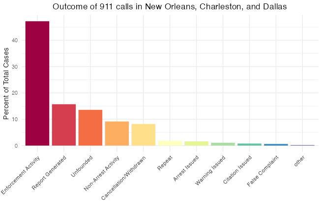

בס"ד


לפני שנתחיל לנתח נתונים ישראליים, באו נלמד כמה נתונים בסיסיים מהמערכת האמריקאית. הנתונים האלה ישמשו לנו כהשערות אפריוריות בניתוח הנתונים הישראליים. חשוב שתהיה לנו הבנה אפריורית מבוססת מכיוון שהנתונים הישראלים שנמצאים ברשותנו כרגע הם לא רק דלים מאוד אלא גם לעתים גם לא ברורים מצד משמעות המשתנים שבם. לעומת זאת, יש לנו [מערך נתונים נקי וברור](https://github.com/tsdataclinic/Vera/tree/master/data) עם מידע מארבעה ערים אמריקאים (ניו אורלינס, דלס, דטרויט, וצ'רלסטון) על סיווג האירועים, ייזום השיחות (מהמשטרה או מהציבור), תוצאת האירוע, והרבה יותר. 
``` r
# Data manipulation
  library(tidyverse)
# Graphics that can deal with Hebrew text
  library(ragg)
  locale("he")

## For the sake of reasonable priors, let's look at some patterns in American 911 data

# American data from Charleston, Detroit, New Orleans, and Dallas 
# (sampled for faster computation - the dataset is 6,347,478 rows long):   
american <- read_csv("/Users/louisteitelbaum/Documents/all_calls.csv")[sample(1:6347478, 20000), -(1:26)]
```
כמה שאלות ראשוניות: 
- כמה אירועים נפתחו בעקבות קריאה למוקד מהציבור (לעומת זהויים עצמאיים של שוטרים)? 
- כמה שיחות הגיעו למוקד אך לא נפתח אירוע תגובה בעקבותם? בכמה מהם האירוע הסתיים בעקבות השיחה/לא היה צורך בתגובה/הטרדה וכו'? 
- כמה פניות למוקד התגלו כמקרי חירום? ממקרי החירום, כמה קיבלו מענה משטרטי?
- האם זה נפוץ שיש שינוי בין זיהוי הראשון של סוג האירוע ודיווח הסופי? יש סוגי אירוע שבהם הסיכוי של סיווג מוטעה גבוה יותר?

נתחיל בשאלת הייזום של השיחות. 
``` r
# What percentage of 911 calls are citizen-initiated?
american %>% 
  filter(city %in% c("Detroit", "NewOrleans")) %>%
  group_by(self_initiated) %>% 
  summarise(freq = n()/nrow(.))
      #> No (Citizen-initiated):  0.443
      #> Yes (Police-initiated):  0.328
      #> Other:                   0.228
```
44.3 אחוז של פניות הגיעו מהציבור בלי הצטרפות המשטרה. חשוב להזכיר שהנתונים האלה מגיעים משתי ערים גדולים (רק דטרויט וניו אורלינס מעניקים את המשתנה הזה). הייתי מנכש שהאחוז יהיה גבוה יותר במקומות פחות עירניים, איפה שיש פחות פעילות משטרתית באופן כללי.

מה עם תוצאות השיחות?
```r
american %>%
  filter(is.na(disposition) == F, city != "Detroit") %>%
  group_by(disposition) %>%
  summarise(percent = 100*n()/nrow(.)) %>%
  arrange(desc(percent)) %>%
  ungroup() %>%
  mutate(disposition = factor(disposition, levels = disposition)) %>%
  ggplot(aes(disposition, percent, fill = disposition)) +
    geom_bar(stat = "identity") +
    guides(x = guide_axis(angle = 45)) +
    scale_fill_brewer(palette = "Spectral") +
    theme_minimal() +
    labs(title = "Outcome of 911 calls in New Orleans, Charleston, and Dallas", x = "", y = "Percent of Total Cases") +
    theme(plot.title = element_text(hjust = .5), legend.position = "none")
```


אחלה תרשים. מה זה אומר? שאלה טובה - יש הרבה קטגוריות פה, ולא ברור מה הם בדיוק. למרבה המזל, מיצרי מערך הנתונים הסבירו את תהליך העבודה שלהם [פה](https://medium.com/dataclinic/creating-a-consolidated-taxonomy-for-911-call-data-across-different-us-cities-part-2-9600cb09abfd)


